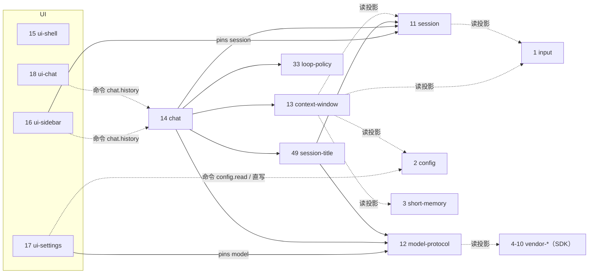

# Chrono 插件设计（插件清单 / 依赖 / 建造顺序）

> ⚠️ **开工前必读 §1.13「做插件前必须先落地的内核 / 宿主改动」**：多数插件依赖内核 / 宿主侧尚未落地的改动（run 级并发、投影闭包解析、受保护 pins、③ 目录、密钥面、线程控制、事件 emitter、资产 / 沙箱面…）。**在旧代码上开做插件会大面积返工**——务必先核对 §1.13 的前置清单。
>
> 状态：本文**只保留插件信息、依赖关系与建造顺序**。各插件的完整设计在自己的目录：`plugins/<身份>/DESIGN.md`（夹具口径见 §1.7「夹具说明」）。
> 框架口径见 `docs/kernel.md` / `docs/host.md` / `docs/plugins.md` / `docs/protocol.md`；**UI 插件化契约与全局设计语言见 `docs/plans/ui-design.md`**。
> 插件按 seed / 审阅顺序编号 **1 -> 49**（**编号连续，无跳号**；装配按 `pins` 拓扑序，§1.6）。
> **§1.7 只定一张插件清单**（1–49 均有 `DESIGN.md`）；**实现按 §1.11 波次推进**（W0→W7）。**决策随插件走**（写在该插件的 `DESIGN.md`）。

---

## 1.2 核心机制约定

1. **一个插件 = 一个包（`package.json` 信封，语言自由）= 一个身份 = 一批成员**；有 `execute` 就有一个宿主托管的子进程（独立世代、独立换代、独立重启）。
2. **写类交互一律"载荷先入世界、命令无参"**：客户端把意图写进输入槽，无参命令触发判定；term 只做管道与选择，服务做数据变换，ctx 与 args 的合流只发生在服务里。
3. **能力调用链只能由 term 发 eff**。UI 插件也能直接依赖后端插件：只要它自己声明命令、入口 term 用 pins 发 eff（UI 的服务进程本身仍不能调服务）。
4. **服务不写链、不做判定**：bag 进、bag 出；不取时间、不用随机——**同输入同输出**是可回放纪律。服务**可以做 IO**（模型服务、工具服务都在做），但**效果一律经宿主**并落审计。
5. **计划值口径**：运行时写计划只能由"拿到了 ctx 的服务"构造，作为顶层 eval 的值经 term 交回宿主；服务没有任何写通道。
6. **数据身份 vs 能力身份**：pins 只用于**能力端点**；**纯数据身份**（无 execute：input / config / short-memory / vendor-* / skill / agents）按字面身份名读写投影，不参与路由；**有 execute 且声明能力类的身份**（session / memory-store / compress / **loop-policy** …）可作 pins 端点。**有 execute 的身份其 `+` 投影读一律由调用方入口 term 完成、经 args/bag 传入**（服务不读投影，通则见 `docs/plugins.md`）。
7. **世界是真源**：配置 / 会话 / 厂商全部写成世界数据（可回滚、可回放、单写者 CAS）；本地文件只能当导出或缓存。
8. **密钥不进世界**：vendor 只存 `auth_ref`（`kind` = `local` | `env`，`name`）；本体住用户本地文件（`local`）或进程环境（`env`），只由 #24 `secrets` 解析成短时句柄。
9. **数据热生效、代码换代**：改 term / 配置 / schema = `add_gen`（进程不动）；改 execute 代码 = 新服务 + 端点表切换 + 旧服务 drain。
   **三类写操作的代价与风险不同层级（本轮口径，编排/图/实例的设计前提）**：

   | 操作 | 载体 | 装配判定（`classifyGenerationChange` 按成员路径） | 生效方式 | 失败后果 |
   | --- | --- | --- | --- | --- |
   | 加 / 改**图、工作流、策略、实例** | 世界里的数据身份 body（**不在包树内**） | 数据世代（代码世代与数据世代同身份） | **热生效，进程不动，身份数不变** | 无（可 `set_active` 指回旧世代） |
   | 改**包内 term / schema / 数据文件** | 包树 `terms/` `schema/` | 非 execute 成员变化 ⇒ **数据换代** | 服务 `reload`/`ack`，进程不动 | reload 未确认 ⇒ 保守按代码换代 |
   | 改 **execute / 加节点能力实现** | 包树 `execute/` | execute 成员变化 ⇒ **代码换代** | 起新服务 + 握手 + 旧服务 drain | 握手/启动失败 ⇒ **该分支隔离（fail-closed，不回旧世代）** |

   - **推论（写死）**：策略 / 图 / 实例一律住**世界数据身份**，不放包内文件 —— 否则改一次策略就要走换代。
   - **改插件 ≠ 直改源码**：世界 append-only，"改"= `put` 新 blob/tree/commit + `add_gen`；回滚 = `set_active` 指回旧世代（一条记账）。
   - **谁改**：只有写指令能改。插件服务**没有写通道**，所以"agent 改插件（含改自身）"= 它的服务/term **产出写计划** → 宿主落账 → 装配换代；不是 agent 直接动手。写新源码用 `write` 指令即可（`eval` 计划条目的 `entry` 必须是字面哈希，与写源码无关）。
   - **agent 改自身的风险**：换代失败即自隔离；所以自改必须有可回退的世代（旧世代始终在链上）与外部触发（客户端提交或前端队列）。
10. **物理端点不进世界**：插件监听的端口、pid、管道只住宿主侧 ③（运行态）。
11. **命名即契约**：身份名、能力类名、方法名、命令名、schema 字段一旦冻结，后续插件照此实现；改名 = 破坏性变更。
12. **展示历史与组装视图分离（红线）**：`#11` 会话消息**全量、追加、独立留存**，是对话面板（`#18`）的**展示真源**；`#13` 的上下文组装（去重 / 配额 / 裁剪 / 冲突消解 / 压缩边界）是**只读派生视图**，只决定发给模型的内容，**永不回写 `#11`、永不删消息**；`#19` 压缩只写 `#3`，`covered_upto` 只是组装边界标记。故换模型 / 换压缩策略 / 回滚边界都不改变已渲染历史。
13. **实现语言自由**：默认 TS；非默认语言在插件 `DESIGN.md` 的「语言」行声明（**Rust：`#20` / `#22` / `#25` / `#28` / `#41` / `#44`**；**`#13` = TS 主体 + Rust tokenizer 子组件**——仅 token 计数下推原生扩展、进程内调用，组装策略留 TS 快迭代，见 `plugins/context-window/DESIGN.md`「原生 tokenizer 子组件」）。包内只放**源码 + 依赖清单**，编译产物 / 依赖目录 / 原生扩展（`node_modules` / `target/` / `*.node`）走**宿主侧 ③ 依赖缓存**（见 §1.13 H15）；宿主只跑 `start`，不认识语言。**接口（能力类 / 方法 / `pins`）与语言无关**——换语言不改调用方。跨语言验收已由 `fixtures/plugins/toy-python`（`host-plan.md` S4.5）与 Rust 插件族共同满足。

## 1.3 术语表

| 词 | 含义 |
| --- | --- |
| 身份（identity） | 世界里的可寻址对象；一个插件包对应一个身份 |
| 世代（gen） | 身份的一次版本：payload（数据/声明）+ pins + sig；`add_gen` 即激活 |
| 成员（members） | 包内被入世的目录：`execute/`、`terms/`、`schema/` |
| 能力类 / 方法 | 跨插件调用的唯一契约：`implements: ["model"]` + `methods: {model:["chat"]}` |
| pins | 调用解析表：逻辑端口名 -> 被依赖身份；装配闭包按 pins 建图 |
| 槽（slot） | 输入插件里的世界数据；客户端写、命令读、回合清 |
| 投影（ctx） | term 能读到的世界只读切片（ids / 世代 / body） |
| 计划通道 | term 返回值里的 `$directives`；宿主机械落账 |
| bag | 服务间唯一通道：投影切片 + 各阶段产出，逐段增补 |
| 审计 | 每次 eff 必落一条 `EffectAudit` def（请求 + 结果） |
| 挂载表 | shell 的本地运行态配置（③）：`{id, path, slot, port}` |

## 1.4 全局命名与约定

- 身份名：小写连字符（`ui-shell`、`context-window`、`model-protocol`、`vendor-custom`）；`vendor-` 前缀 = **厂商适配（连接层）**，`ui-` 前缀 = 界面插件，`tool-` 前缀 = 具体工具。
- 能力类名 = eff 的 port；方法名为动词（`render` / `build` / `chat` / `commit` / `discover`）。
- 能力类名登记：`model`(12) / `context`(13) / `session`(11) / `memory`(21) / `memory-maintenance`(23) / `retrieval`(22) / `compress`(19) / `embedding`(20) / `secrets`(24) / `sandbox`(25) / `guard`(26) / `tools`(27，**仅注册表**) / **工具提供者：每身份一个类，类名 = 身份名** —— `tool-fs`(28) / `tool-shell`(29) / `tool-http`(30) / `tool-browser`(31) / `mcp`(37) / `plugin-admin`(42，工具类) / `orchestration-admin`(45，工具类) / **`evolve-metrics`(44，工具类：`record`) / `todo`(47) / `question`(48)** / `approval`(32) / `router`(34) / `workspace`(41) / `plugin`(42，管理 API) / `orchestration`(45，管理 API) / `ui-<身份名>`(各 UI 插件，含 15 `ui-shell`、46 `ui-threads`) / **`loop-policy`(33，图解释器)** / **`session-title`(49，独立服务类名)**。**`tools` 是注册表、工具提供者类是提供者，两层不可混用**；**同一能力类不可被两个身份同时声明**（端口名 = `pins` 键，单值），故 #21 与 #23 分用 `memory` / `memory-maintenance`，且**工具提供者各用身份名作类名**（若都叫 `tool`，#27 的同名 pin 第二个就撞 / `unresolved_cap`）。**降级链别名另需目标身份显式声明该别名能力类**（见 §1.6 / `#34`）。
- 命令名：`<域>.<动作>`（`chat.send` / `session.new` / `model.discover`）；不得占用宿主保留字 `start` / `stop` / `run` / `status` / `seed` / `pack` / `verify` / `replay` / `compact` / `audit` / `assets`（CLI 另有 `commands` / `help`）。
- 命令按名调用，不需要 pins；只有插件自己要用 pins 发 eff 时才产生依赖边。
- schema 文件放 `schema/`，为 JSON Schema 白名单子集（宿主做方言元校验 + 形状校验）。
- 插件包骨架：
  ```
  plugins/<name>/
    package.json        # 仅构建/测试用；运行时零依赖
    plugin.json         # 声明 12 字段：identity / schema / implements / methods / pins / start / protocol / restart / health / state / members / commands
    README.md           # 契约说明（人读的唯一权威补充，自述文档）
    schema/             # 数据形状（有世界数据时必填至少一个；无世界数据的 execute-only 插件可空）
    terms/              # term def（0..n）
    execute/            # 服务代码（0..1）；零依赖或预打包
    test/               # 不入世界
    .worldignore
  ```
- 服务代码自实现 stdio 帧协议；插件侧不 import 内核、不 import `packages/client`（它 import 内核）。

## 1.5 插件设计模板

| 字段 | 内容 |
| --- | --- |
| 编号 / 身份 | 累积序号与名字（依赖一律引用编号） |
| 职责 | 一句话；"做什么"与"不做什么" |
| 依赖 | `->` pins（会发 eff）；`~` 运行期按命令名调用；`+` 读投影；`<-` 被谁依赖 |
| 成员 | execute / terms / schema |
| 能力类·方法 | `implements` 与 `methods` |
| 命令 | 名字、args、语义（**写类命令一律无参**，载荷先入槽；读 / 纯动作命令可带 args，如 `chat.history {conversation,before,limit}` / `workspace.reveal {workspace}`） |
| schema | 文件名与关键形状 |
| 机制 | 关键流程：读什么、写什么、事件、异常分支 |
| 边界 | 明确不做的事 |
| 验收 | 3–5 条可测断言 |
| 状态 | 已定 / 待讨论（含未决点） |

## 1.6 依赖总则

- **pins 是有向边，方向 = 调用方向**；装配时依赖先起；成环 / 缺失 / 自环-> 整条依赖链隔离。
- 命令按名调用不是依赖边；数据身份按字面名读投影不是依赖边。
- **编号 = seed / 审阅顺序，不是依赖序**：依赖以 `pins` 为准，**允许指向任意编号（含更大编号）**；唯一硬约束是 `pins` 闭包无环（成环即隔离）。**装配按 `pins` 拓扑序（依赖先起），编号大小不影响解析**；只有依赖本身被隔离 / 未就绪时，才连带隔离本插件（fail-closed）。
- **版本提升**：允许后编号插件要求前插件升一代（加字段 / 加渲染 / 改 schema）。三条规则：① 必须**双方各记一条**（提出方写"提升 N"，被提升方写"版本提升：M 到位后 …"）；② 只改数据 / 声明，不改调用方向；③ 一旦实现即冻结，再改只能继续升代。
- 对话相关依赖图（#1–#18 一带；实线 = pins，虚线 = 运行期调用 / 投影读）：



装配 = `pins` 拓扑序（依赖先起）；seed / 审阅 = 编号顺序。#16 已 `->` #41，波次表把 #41 放在 W0、#16 放在 W5。

## 1.7 插件清单（1–49）

> 依赖列：`->` pins；`~` 按命令名调用；`+` 读投影；`<-` 被谁依赖（引用编号）。依赖可指向任意编号（§1.6），编号只定 seed / 审阅顺序。
> `版本提升` 表示后续插件会要求前插件升一代（加字段 / 加渲染）；按 §1.6，双方 `DESIGN.md` 各记一条。
> 每行的完整设计见各插件目录 `plugins/<身份>/DESIGN.md`。**夹具说明（2026-09-19 澄清）**：`fixtures/plugins/` 现只存放宿主测试用 toy 包（`toy-alpha` / `toy-beta` / `toy-python`，见 `docs/plans/host-plan.md` S4.5）与 `model-stub`（确定性 `model` 夹具，供 #12 / #33 / #14 测试）；**交付插件的逐份夹具 `fixtures/plugins/<身份>/DESIGN.md` 随实现波次补齐**（W0–W7 各波建包时同步建夹具），当前不存在 ≠ 缺失。
> **编号 = seed / 审阅顺序**（装配按 `pins` 拓扑序，§1.6）：撤销 / 并入的项**不占编号、不在表内占位**（本次已整体重排为连续 1–49）。
> 已撤销 / 并入的项（prompt / tool-code / audit / planner / critic / handoff / scheduler / subagent / agent-channel / ext-pack / bench / scorer / monitor / diagnoser / evolve / meta-eval / curriculum / ui-cli / ui-voice / forget）**能力已写进承接插件的 `DESIGN.md`，不占编号**。
> **已决定不做**：`api-face`（平台对外的 OpenAI 兼容面）——**不占编号、不在表内占位**；需要远程 / 外部接入的用户，由平台 agent 经 `#42 plugin-admin` 自行构建（自举路径）。
> **候选新插件（未定编号的如下，不改现有编号；见 `docs/plans/ui-design.md` §14 残留待办；已定编号的 #49 `session-title` 见下表）**：
> - 已有：i18n 文案机制（**2026-09-19：文案表 = #15 `messages.v1.json` 唯一来源、覆盖全身份错误码已定；多语言切换策略后置**）。（原「社区模型资料源」已并入 `#12 model-protocol` 的 `profile`；「记忆族 UI 入口」已并入 `#17 ui-settings` S12 记忆 tab；「多模态内容装配」已并入 `#13` 调配器格式化阶段；「token 计数与上下文预算」已并入 `#13` 调配器；**「per-message usage 事件源」已结清——`#11` 消息 def 的 `meta.usage` 即真源，`#18` 直接读**）
> - 本轮新增并编号：**#42 `plugin-admin`**（agent 的插件管理面：`list` / `read` / `validate` / `write`；**可见性过滤排除 `sandbox` 与自己**——沙箱对 agent 隐藏点，见 `plugins/plugin-admin/DESIGN.md`）。
> - **2026-09-19 新增并编号 #43–45（agent 图与自进化；完整设计见 `docs/plans/agent-graph-design.md`）**：**#43 `evolution`**（数据身份）/ **#44 `evolve-metrics`**（执行件，纯计算非 LLM）/ **#45 `orchestration-admin`**（执行件）。三者的**两层分签**是结构性约束：`#44` 只产证据不提案、`#45` 只产提案不产证据不产写——给指标层加任何写面就等于"自己诊断自己改"，评审再也无法机械验证。
> - 本轮登记（能力真空缺）：多模态输出源（图像生成 / TTS）、音频识别（agent 侧，原生 + 非原生两路）、附件与文档处理（PDF / docx / 表格文本提取、图片转码、大文件分块）、工具结果渲染（各工具自带 UI）、权限规则（工具 / 路径 / 命令映射到既有四档）。**（2026-09-19 收口）会话删除 / 标题搜索 / 导出已定形态并入 #16；自动标题定案并入新插件 #49 `session-title`（用户配置的模型 + 首条用户消息 + ≤10 字）；导入 / 分支形态已定、分期（分支需 #11 版本提升）；错误文案表覆盖归 #15 `messages.v1.json`。**
> - **2026-09-19 线程设计（完整见 `docs/plans/threads-design.md`）**：线程 = #11 会话 + `kind` / `parent` / `agent` / `participants` / `workflow` + **`inbox`（收件箱）** / `status` / `last_activity` / `pending`；**真并发（改宿主：run 级并发 + 提交队列 + 乐观校验；内核 `run` 语义不变）**；顶栏新插件 **#46 `ui-threads`**；群聊 / 步骤卡并入 #18 按 `kind` 分派；**子代理 ≠ 协作者**（子代理 = 子线程：隔离上下文 + **双向通信**——父可 `instruction` / `status` / `resume` / `terminate`，子可 `decision_request` / `report`，**默认只回最终报告**；协作者 = 圆桌群聊）。
> - 已结清（并入现有插件）：「模型调用韧性」→ `#12 model-protocol` v1（重试 / 退避 / 限流 / 流断重连）；「对话面板」→ `#18 ui-chat`「全能内容渲染面」（markdown / 流式 / 图像 / 视频 / 音频 / 文件卡 / 工具卡）。

> 一张表，1–49 均已展开设计。编号不是建造序——**实现按 §1.11 波次**。

| # | 插件 | 干嘛的 | 边界（不做什么） | 依赖 |
| --- | --- | --- | --- | --- |
| 1 | `input` | 用户意图信箱（**per-thread 键控寄存器** · 数据身份，细节设计已完成） | 队列 / 重试 / 语义校验 / 历史 / 判定 | `<-` 11（清槽写 idle 世代）、41（清槽）、**17（`model.probe` 清槽）**、**32（`approval.decide` 清槽）**、**48（`question.answer` 清槽）**、13（投影）；14 / 16 / 39 投影读判分支（非边） |
| 2 | `config` | **用户模型配置**：连接实例（`base_url` / `auth_ref`；自定义含 `protocol`）+ 模型目录与元数据 + 参数 / 权限档 / 主题 / 语言 / 侧栏宽度 + 当前选择 | 明文密钥 / 用户体系 / 厂商 SDK 适配（归 4–10）/ 联网取数（归 12） | `<-` 12（读写：连接 + 档案元数据）、13（读上下文窗口）、15（写主题）、16（写侧栏宽度）、17（读写）、25（读权限档）、38（读 `ui.notify` 开关）、40（读推理档、写模型 / 推理强度 / 权限档）、**49（读 vendor / model / params）** |
| 3 | `short-memory` | **记忆 L1/L2 存储本体**：L1 会话摘要（每会话一条，结构化字段，**TTL 24h**）+ L2 工作区累积（每工作区一条，去重合并，无 TTL） | 压缩算法（归 19）/ 去重向量化（归 20、23）/ 检索（归 22）/ L3 本体（归 21）/ 判定（归 33 准则） | pins 无；`<-` 13（投影读注入）、19（写回计划）、23（合并 / 清理计划） |
| 4–10 | `vendor-openai` `-deepseek` `-dashscope` `-google` `-zai` `-kimi` `-custom` | **厂商适配（连接层，纯数据）**：`sdk` 标识 + **声明式 `quirks`**（protocol / impl / auth_style / system_role / reasoning_field·map / max_tokens_field / models_path / stream_usage / extra_headers）+ 模板默认值（预填 URL 与 env 名）；**混合实现**（三协议自实现 + 怪厂商 SDK，如 Google） | 用户实例（`base_url` / 密钥 / 模型目录 / 参数，归 2）/ 代码 / 端口 | `<-` 12（读 SDK 与怪癖）、17（读模板预填） |
| 11 | `session` | 会话数据 + 提交服务（原子写计划）：**消息各自成 def + 链式 `head`**、会话元数据进 body；**历史读取按 `prev` 窗口 + `next_before` 游标**；**`select` 切 `current`** | 搜索 / 朗读 / 调模型；写只限自身 + `input` 清槽（经计划通道）；不删消息、不做去重 | `+` 1；`<-` 13（投影）、14、16、27（pins：`subagent.send`→`deliver`）、33（pins） |
| 12 | `model-protocol` | 多 SDK / 三协议 HTTP/SSE（**混合**：三协议自实现 + 怪厂商 SDK）+ **韧性（重试 / 退避 / 限流 / 流断重连）** + `discover`（URL→列表）+ `profile`（models.dev→所选模型档案，**定期后台同步**）+ `vendors`；**`model.sync` 方法为定时触发入口（宿主直接调方法；所需 `#2` 投影片段由宿主按 schema 注入 bag，服务不读投影）**；**`model.complete`（非流式单次补全，供 #49）** | 降级链（#34）/ 落账 / 密钥解析（归 24）/ 厂商适配数据（归 4–10） | `->` 24（pins：密钥解析）；`+` 2（连接实例与所选模型）、4–10（SDK 与怪癖）；`<-` 14、17（pins）、19、22、33、34、49 |
| 13 | `context-window`（TS + Rust tokenizer） | **上下文调配器**：候选汇集 → 结构化 → 去重（规范化留最新）→ 预算建模 + token 计数（**按 def 哈希缓存 + 前缀和**）→ 配额分配 → 裁剪（保工具对）→ 来源调度 → 冲突消解 → 前缀缓存排序（**稳定前缀 = 系统提示 + 工具 schema，L2 移出**）→ 按方言格式化（含多模态）→ 组装清单（事件）→ 75% 触发（**基数 = 可用预算**）→ **交错引导语**（工具结果回灌后追加「说意图、禁标识符」system 引导）；**读时 TTL 过滤**（注入前校验 #3 `expires_at`，过期 L1 不注入）；产出 messages 与请求参数。**不是回合第一个服务**（召回段 #22 先写 bag）；**系统提示 / 工具 schema 由上层 bag 传**（不 pin #27 / #33） | 调模型 / 写世界 / 压缩本体（归 19）/ 模板引擎 | `+` 1、2、3、11；`<-` 14（pins）、33（pins）；版本提升：22 加记忆引用字段、36 加技能片段、3 注入契约（含读时 TTL 过滤） |
| 14 | `chat` | 命令面（send / history，history 支持 `conversation` / `before` / `limit` 窗口）+ 回合管道 term + 接线 | 写世界 / 分支策略 / 自建循环（归 33） | `->` 11、12、13、**33（`loop-policy`：入口 term eff `loop-policy.interpret`）**、**49（首条消息标题段）**；`+` 1（读槽判分支）；`<-` 16、18（按名）；版本提升：33 替换其管道；34 到位后**新增** `router` pin + 备选别名 pin（`model` 仍 pin 12）；v1 不接降级链 |
| 15 | `ui-shell` | 壳：**浏览器唯一入口（主端口 + 入站桥）** / 布局槽 / 路由 / 反代 / token·图标·文案表 / 断线横幅 / **全局 toast** / **跨 slot 视图状态 `api.uiState`** | 渲染业务面板 / 业务判定 / 读投影 | 无 pins；`~` 2（`config.read`，判"无配置"）；`<-` 16、17、18、38、39、40、46（挂载 / headless） |
| 16 | `ui-sidebar` | 工作区分组 + 会话列表 + 按工作区新建 + **会话切换（`session.select`）** + 重命名 + 添加 / 移除工作目录 + 在文件管理器中打开 + **状态角标（运行 / 待审批 / 失败 / 未读）** + **会话管理（删除软删 / 撤销 / 标题搜索 / 导出 / 分支）** | 渲染消息 / 判定 / 消息级删除 / 跨会话全文搜索 / 工作区本体与路径校验（归 41） | `->` 11（pins：`session.new`/`select`/`rename`/`delete`/`restore`/`branch`）、41（pins）；`~` 14；收宿主事件 `run.*` / `thread.updated` / `approval.pending`；`<-` 15 |
| 17 | `ui-settings` | 引导页（模板 / 自定义同一流程）+ 设置模态 S7–S13（通用 / 模型 / 插件 / 技能 / **记忆** / **编排** / 关于） | 对话视图 / 判定 / 存密钥（只存 `auth_ref`）/ 记忆本体与维护（归 3、19、21–23） | `->` 12（pins：vendors / discover / profile）、**24（pins：`secrets.list`，S8 状态）**；**版本提升**：22/23 到位后新增 `retrieval` / `memory-maintenance` pins（S12，双方各记一条）；`+` 1、33、35、43（投影读 `model.probe` / 图 / 人格 / 台账）；`~` 2；订阅 `api.uiState`（`boot_mode` / `settings_open`）；写 = 直写 2；`<-` 15 |
| 18 | `ui-chat` | **全能内容渲染面**：markdown / 流式 / 图像 / 视频 / 音频 / 文件卡 / 工具卡 / **question 交互卡** + 内联错误 + **消息 `meta.usage` token 脚注** + 复制反馈 + **群聊 / 工作流步骤卡** + 长列表窗口化；订阅 `api.uiState.active_thread` | 循环逻辑 / 列表 / 设置 / 审批卡片（归 39）/ 输入卡（归 40） | `~` 14；`<-` 15；版本提升：40 到位后输入卡移出；线程字段（`kind` 分派群聊 / 步骤卡） |
| 19 | `compress` | **压缩引擎**（三种）：`summarize`（会话摘要 → L1）/ `compact`（上下文压缩，75% 触发）/ `extract`（抽 2–3 条 → L2）；`mode` 可纯算法或语义 | 直接写链（只返回计划）/ 检索（归 22）/ 去重合并与固化（归 23）/ 触发判定（阈值归 13、准则归 33） | `->` 12（semantic 模式）、**20（去重向量化，执行件，投影读替代不了调用）**；`+` 3、11；`<-` 33（管道 / 回合尾）、27（记忆工具）、**23（需要摘要时）** |
| 20 | `embedding`（Rust） | 本地向量化：窗口切块 + granite-97m（int8 ONNX，384 维归一）；Rust / `ort`，权重内嵌二进制 | 存储 / 检索 / 重排 / 触网 | pins 无；`<-` 21（建 / 重建索引）、22（查询向量）、23（去重）、19（去重用向量） |
| 21 | `memory-store` | 长期记忆本体（**L3**）：条目进世界（各自成 def + **链式 `tail`**，chunks 只存偏移）；**向量索引宿主侧 ③ 可重算**；来源 = agent 显式保存 + #23 固化 | 检索策略 / 压缩 / 遗忘决策 / 向量计算（归 20） | `->` 20（pins：建 / 重建索引）；`<-` 22、23（投影 / 计划写回）、27（记忆工具）；能力类 `memory` |
| 22 | `memory-retrieval`（Rust） | L3 召回：查询构造 / 多查询 → 向量 + 暴力余弦 top-k → 工作区范围 / 标签 / 来源过滤 → 时间衰减 → 与在上下文内容去重 → MMR + 语义重排 → 预算感知截断 | 写入 / 压缩 / 向量化实现（归 20）/ 存储实现（归 21）/ 组装（归 13） | `->` 20、21、12（多查询 / 重排，可关）；`+` 3、11；`<-` 33 管道、27（记忆工具）；提升 13（加记忆引用字段） |
| 23 | `memory-consolidate` | **记忆维护（全层）**：L1 TTL 清理（24h）+ L2 去重合并 + L2→L3 固化 + L3 过期 / 遗忘 / 删除计划 + agent 顺带清理候选（去重用本地向量余弦）；能力类 `memory-maintenance` | 调模型（交 19）/ 直接写链 / L3 存储实现（归 21）/ 向量计算（归 20） | `->` 19、20、21；`+` 3、11、21（构造 L3 写计划须读 #21 投影）；`<-` 33（按策略触发）、27（记忆工具）；**`consolidate`/`sweep` 周期由宿主定时触发**（周期住 schema） |
| 24 | `secrets` | **唯一密钥面**（模型族 + 工具族）：本体住**宿主侧用户本地文件**（世界排除）+ `auth_ref` -> 短时句柄；`secrets.put` 走宿主入站面；**`resolve` 结果经宿主审计脱敏**（只落句柄描述） | 明文落账 / 明文进世界 / 明文进审计 / 明文进 config 导出 | `+` 2（`auth_ref` 由 #12/#29 入口 term 读出后随 `resolve` args 传入；服务不读投影）；`<-` 12（模型族）、29（`tool-shell` 命令执行）、**17（S8 `secrets.list` 状态）** |
| 25 | `sandbox`（Rust） | 隔离执行（多实现可换）：Rust 原生 OS 级（win32 / linux）+ Docker；一次性 `exec` + **结构化文件操作 `fsop`（S2 已展开）** + 资源上限；`caps` 驱动 fs 范围（四档钳制）+ **消费批准后的一次性 `caps.grant`**；**#28 要求的结构化操作执行面已定** | 工具语义 / 审批判定（归 26）/ 危险定义（归 26）/ 网络策略决策 / 长驻交互会话 | `+` 2（读 `permission` 全局档）；`<-` 28–31 |
| 26 | `guard` | 工具调用语义门（纯函数）：**只判「工作区外 / 危险操作 / 外部 MCP / 结构写高危」是否升级弹卡**（4 档 fs 强制归 #25） | fs 范围强制（归 25）/ 审批 UI / 等待审批 / 调 32 | `+` 2；`<-` 27 |
| 27 | `tools` | 工具注册与派发（**`tool` 端口契约由本插件冻结**，见 `plugins/tools/DESIGN.md`）：**两种提供者**——`describe`/`invoke` 工具类 + **能力类工具绑定**（tool 名 → class+method+argsSchema+render）；工具描述**四要素必填**（行为意图 / 使用时机 / 参数语义 / 使用边界，缺一 `bad_tool_decl`）；**整批 `calls[]` 一次 eff、进程内并发扇出**（并发上限住 schema）；工具卡 **`render` 描述符**随消息快照进 #11；**写类工具的计划值由 #33 `tool.dispatch` 冒泡并入顶层 `$directives`** | 具体工具实现 / 审批流程 | `->` 26（pins：先过语义门）；**工具提供者按各自类名 pin**：`tool-fs`→28、`tool-shell`→29、`tool-http`→30、`tool-browser`→31、`mcp`→37、`plugin-admin`→42、`orchestration-admin`→45、`todo`→47、`question`→48、`session`→11（`subagent.send`/`status`）、**`evolve-metrics`→44（`record`）**；记忆工具（能力类绑定）：`compress`→19、`memory`→21、`retrieval`→22、`memory-maintenance`→23；`+` 37 / 11 / 41（外部工具清单与执行根由**调用方入口 term 读投影后随 bag 传入**，服务不读投影，D8）；`<-` 33 管道（pins；`#14` v1 不 pin 本插件） |
| 28 | `tool-fs`（Rust） | 文件工具：`read` / `edit` / `glob` / `grep`（**工作区内 + 区外**结构化读写；区内 / 区外由 #25 档位强制、区外经 #26 升级） | 绕过 guard / sandbox / 通用命令执行（归 29） | `->` 25 |
| 29 | `tool-shell` | 命令执行工具 | 绕过 guard / sandbox | `->` 24、25 |
| 30 | `tool-http` | 联网检索与抓取：`websearch`（**多免费源 · 零配置 · 无 API key**）/ `webfetch`（无状态） | 绕过 guard / sandbox / 有会话与 JS 渲染（归 31）/ 需 key 的搜索源 | `->` 25 |
| 31 | `tool-browser` | 浏览器自动化：`webbrowser`（会话 / 渲染 / 交互 / 截图） | 绕过 guard / sandbox / 无状态抓取（归 30） | `->` 25 |
| 32 | `approval` | 审批流程与回执（无命令面；**队列进世界**、多项、整批裁决；**超时挂起 + 可配时长、不自动拒绝**；**跨 run 挂起/续跑**、裁决清槽；args 只存摘要 / 资产引用） | 渲染（卡片归 39）/ 工具派发 | `+` 1；`<-` 39（pins：命令入口）；事件与 39 约定 |
| 33 | `loop-policy` | **唯一的策略 / 图解释器**（**服务自驱**：图执行住 execute、`pre`/`post`/`when` 为服务内声明式规则、节点经反向调用 `port.call` 派发）：回合管道 + 图执行 + 审批往返（**跨 run 挂起/续跑**）+ 回合尾触发；图/策略住本身份的数据世代；六类条目（契约 / Scope / **提示词** / 图 / 阈值 / 拒绝码）；**系统提示词住 `prompts.system`**（行为准则 + 产品事实、只谈意图、**禁工具标识符**），由 `context.assemble` 阶段写进 bag 交 #13 | 自建特权引擎（宿主不给特殊路径）/ 节点实现 / 直接写链 / 多图选图 | `->` 11–13、19、22、23、27、32、34、**44 `evolve-metrics`** + 全部节点能力类（pins = 节点类型空间）；`+` 35、36、41、43、47（**由 #14 入口 term 读投影后随 bag 传入**，服务不读投影）；`<-` 14（版本提升：替换其管道，入口 term eff `loop-policy.interpret`）、17（S13 投影读） |
| 34 | `router` | 模型 / 能力选择（**选别名端口名**；别名 pin 各指向一实现，目标须显式声明该别名能力类）；**v1 不实现降级链**（无备选 model 实现、别名机制骨架保留待 v2） | 调用实现 / **改调用方 `model` pin 指向**（`model` 仍 pin 12） | `->` 12；`<-` 14/33（**新增** `router` pin + 备选别名 pin） |
| 35 | `agents`（原 `agent-registry`） | **智能体数据身份**：模板 / 实例 / 通道的**索引**（各自成 def + **链式 `tail`**，不列全量哈希）；原 `subagent` / `agent-channel` 并入；**纯数据身份，按字面名投影读、不参与路由** | 特权（框架无特权插件）/ 消息传输实现 / 实例自带执行权 | `<-` 33（投影读 + 写回计划）、**45（提案改 `scope` / 加子代理）** |
| 36 | `skill` | 技能包（数据身份）：**结构化触发**（keywords / file_globs / explicit）+ 描述 + `body`；**全局 + 可选工作区**；**纯数据身份，按字面名投影读、不参与路由（不进 #33 pins）** | 代码执行 / 片段拼装（归 13）/ 挑哪份技能（归 33） | `<-` 17（直写：S11）、33（投影读：按准则选用）、**45（提案改 `scope`）** |
| 37 | `mcp` | MCP 适配器（**双向**）：出站接外部 MCP 服务器并把工具清单写成本身份投影（由 #27 读）；入站把本产品能力以 MCP 暴露（HTTP/SSE，**经 #15 主端口反代 `/p/mcp/*`**，不自开端口）；**外部进程不经 #25（保留例外，#26 判 mcp 工具升级补偿）**；**新增 `terms/` 入口**（出站发现产投影写计划、入站翻译产命令 + 写槽计划，宿主转发入站帧触发 run） | 工具派发本体（归 27）/ 绕开 27 / 判定 / 直写世界 | pins 无；`<-` 27（pins：派发其工具）；`+` 无需；**宿主定时触发**（出站清单周期刷新） |
| 38 | `ui-notify` | 系统通知（**headless 前端，由 #15 以 `headless` 条目加载，不占 slot**）：订阅 7 类事件（待审批 / 回合完成 / 回合失败 / 模型错误 / 断线 / 编排连续失败 / 提问待作答），失败与提问始终通知、待审批·完成仅无焦点时；编排连续失败由 #44 自动发（不依赖用户打开 S13）；开关住 `2.ui.notify`；只读命令 `notify.state` 回开关与浏览器权限状态 | 会话视图 / slot 视图 / 判定 / 写世界 | 收宿主事件；`+` 2（读开关，经 `notify.state` 入口 term） |
| 39 | `ui-approval` | 审批卡片（**dock 槽**，声明 `approval.list` / `approval.decide` / `approval.decide_all` 命令）：**摘要 + 可展开全量**、整批裁决、**等待计时 + `expired` 弱化 + 「全部拒绝=放弃并终止」**、**[全部批准] 与 [全部拒绝] 均 3s 二次确认** | 判定 / 审批流程本体 / 对话视图 | `->` 32（pins：命令入口）；`<-` 15（挂载 dock）；事件与 32 约定 |
| 40 | `ui-composer` | 输入卡（**composer 槽**）：文本 / **附件（原生选择器 + 任意格式）** / 模型 / 推理强度 / **权限档（全局，驱动 #25 强制）** / 发送终止 / **上下文用量行** | 消息流 / 列表 / 设置 / 判定 / 持有回合状态 | 无 pins；`~` 2、14 / 33、`model.profile`（按名，归 #17 声明）；收 `context.assembled` / 宿主 `run.*`；写 = 直写 2 + `input` 槽；`<-` 15（挂载 composer）；版本提升：要求 18 移出输入卡 |
| 41 | `workspace`（Rust） | 工作区：列表**进世界** + 最近打开（③）+ 路径校验 + 系统原生目录选择器 `pick` + 文件管理器 `reveal` | 会话列表与分组渲染（归 16）/ 文件读写（归 28）/ 白名单外访问 / 目录改名追踪 | 无 pins；`<-` 16（pins：`list` / `pick` / `add` / `remove` / `reveal` 命令入口）、11（版本提升：加 `workspace_id`）、1（版本提升：加 `workspace.*` 槽 kind / 字段）；28–31 / 25 执行根由**入口 term 读投影解析**后经 #33/#27 **bag 传**（非 pins） |
| 42 | `plugin-admin` | agent 的插件管理面：**工具名 `plugin.list` / `plugin.read` / `plugin.validate` / `plugin.write`**（产出写计划）；**可见性过滤**排除 `sandbox` 与自己；**受保护 `pins` 不可删**；`validate` 走宿主**入世 dry-run 面** | 改内核 / 改宿主 / 绕过过滤 / 装配换代 / 直接写链 / 人可见插件页（归 #17 S9）/ **改 #33 图数据（归 #45）** | pins 无；`<-` 27（pins：以工具类 `plugin-admin` 暴露）；读源码走宿主源码读面 |
| 43 | `evolution` | **进化台账数据身份**：四类链式 tail —— `trace`（回合尾轨迹摘要）/ `evidence` / `proposals` / `verdicts`（采纳与拒绝都写） | 判定 / 聚合 / 提案 / 渲染；不起进程 | 无 pins；`<-` 33（投影读 + 写回计划）、44、45、17（S13 台账只读） |
| 44 | `evolve-metrics`（Rust） | **指标层**（纯计算、非 LLM、同输入同输出）：按 `(RefusalCode, attributable_to, workspace_id)` 聚类 + 成本异常 + 实例漂移 + 折叠候选 + `no_progress` + `post_failure` + `verify_failure` → 产证据条目计划；**`shadow`** 影子回放（门禁第二道，零 token）；**`record`** 产 `user_request` 证据；**发 `orchestration.unhealthy` 事件**（超阈值自动发，非 #17） | **提案**（分签红线）/ 调模型 / 直接写链 / 判定该不该改 | `+` 43、33（投影读 `thresholds`）、**`host`（`audit`，影子回放读 `EffectAudit`）**；`<-` 33（pins：`aggregate`）、27（pins：**能力类工具绑定** `record` → `evolve-metrics`，2026-09-19 补）；**`sweep`/`aggregate` 周期由宿主定时触发** |
| 45 | `orchestration-admin` | **agent 面编排管理**：**工具名 `orchestration.list` / `orchestration.read` / `orchestration.validate` / `orchestration.propose`**（`validate` = 本地复刻 #33 机械闸 dry-run）；**只产提案条目、不产写**；**user_request 证据由 #44 `record` 产**（保分签） | **产证据**（分签红线）/ 直接写图 / 改插件源码（归 #42）/ 装配换代 | `+` 33、43、11 / 41（投影读）；`<-` 27（pins：以工具类 `orchestration-admin` 暴露） |
| 46 | `ui-threads` | **线程顶栏**（slot `topbar`）：hover 显示 / 离开隐藏，位于侧边栏右侧、main 顶部；标签 = 线程列表（对话 → 会话标题 / 子代理 / 群聊 / 工作流）+ **待办标签位**（**按当前父会话读 #47**），点击切线程（经 `api.uiState` 广播 `active_thread`）；**内容按父会话隔离**；只读命令 `threads.state` | 对话渲染（归 #18）/ 群聊与步骤卡（归 #18 按 kind 分派）/ 判定 / 写世界本体 | 无 pins；`~` 14（读会话列表 / 标题）；`+` 47（待办标签，按父会话）、11（线程字段）；`<-` 15（挂载 topbar）；收宿主事件（`thread.*` / `workflow.step` / `group.message`，emitter = #11） |
| 47 | `todo` | **任务清单 / 待办清单**（**进世界、按会话持久**：body 按 conversation 键控）：工具 `todo.write`（整表替换）/ `todo.read`；**收口门禁**（有未完成项 ⇒ #33 不收口、继续 loop，防"幻觉式收尾"）；渲染 = 工具卡 + 顶栏待办标签位 | 判定"是否真做完"（只做机械检查）/ 写其他身份 / 长期知识（归 #21） | `<-` 27（pins：工具类 `todo`）、46（顶栏）、33（门禁投影读）；`+` 11（**由调用方入口 term 读当前会话 id 后随 bag 传入**，服务不读投影） |
| 48 | `question` | agent **向用户提问并等待回答**：工具 `question` + 命令 `question.answer`；队列进世界、**复用 #32 的跨 run resume**（不阻塞）；渲染 = **消息流内交互卡**（单选 / 多选 / 自定义，已答折叠）；**#33 `loop.when` 加 `question_pending`（提问后本 run 正常结束）**；发 `question.pending` 事件供 #38 通知 | 审批判定（归 #26 / #32）/ 写其他身份 / 阻塞等待 | `<-` 27（pins：工具类 `question`）、33（按游标续跑）；`+` 1（清 `question.answer` 槽）、11；版本提升：要求 #1 加 `question.answer` 槽 kind；**发 `question.pending` 事件** |
| 49 | `session-title` | **会话自动标题**：按**首条用户消息**用**用户配置的模型**生成 **≤10 字**标题，写入 #11 `title`；**非流式**（`#12 model.complete`）、旁路失败不阻塞回合、不覆盖用户手动标题 | 标题显示（归 16 / 46）/ 重命名 UI（归 16）/ 调模型实现（归 12）/ 判定是否首条（归 14） | `->` 12（pins：`model.complete`）、11（pins：`set_title`）；`+ 2`；`<-` 14（pins：管道段 `session-title.generate`，仅首条消息） |
| — | `fixtures/plugins/model-stub`（夹具，非交付） | 确定性 `model` 实现，供测试 | 交付 | `<-` 测试 |


## 1.8 UI 插件化契约

> 已迁至 `docs/plans/ui-design.md` §15：slot 应用 / headless 两档、布局槽与纵向顺序、挂载表与反代、子应用入口契约（含 `api.uiState`）、事件与失败隔离。

## 1.9 全局 UI 设计语言

> 已迁至 `docs/plans/ui-design.md`（tokens.v1 全文：颜色 / 字体 / 间距 / 圆角 / 层级 / 动效 / 图标 / 交互状态 / 组件映射 / 验收）。本节编号保留，供各 `plugins/ui-*/DESIGN.md` 引用不失效。

## 1.10 验收（随波次累积）

1. 每波入世后：该波插件装配 / 握手 / 命令 / 落账通；全部卸载后内核与宿主测试全绿。
2. 换实现不改调用方：12 换代（含夹具）、2 换厂商、14 换管道、11 换实现 -> UI 零改动。
3. 插件包内不出现内核 import（含测试）。
4. 回放：seed -> 配置 -> 对话 -> 重启 -> `replay(full)` 逐字节一致；模型调用不重放。
5. UI 插件化：15/16/17/18/38/39/40/46 随所在波独立换代、独立失败隔离；配色与全部视觉规格以 `docs/plans/ui-design.md`（token 唯一来源）为准；38 headless 不占端口。
6. 首次引导统一流程：厂商模板与自定义厂商都能完成配置并立即对话（W2 `#17` 后可验）。
7. 密钥不进世界；错误提示不泄漏密钥。
8. ~~已批准的框架最小改动落地：超时透出与真取消（协议 cancel + 宿主丢该 run 计划 + 审计新增 cancelled 结局）；`docs/plugins.md` 补计划值口径一句。~~ **已完成**：超时透出、协议 `cancel{run}` 真取消均落地；`docs/plugins.md` §二 已补「计划值口径」一句（服务无写通道）。

## 1.11 推进波次（依赖驱动的建造顺序）

> 口径：**建造顺序 = `pins` 拓扑序（被依赖者先建）**，编号只定 seed / 审阅顺序（§1.6）。同一波内可并行。
> 「建」= 包入世 + 声明冻结 + 依赖就位；数据身份可先入世，有 execute 的服务在其依赖就位后再验收。`~`（按命令名调用）与 `+`（投影读）不是建造前置，但验收需要对方在。
> ⚠️ **波次之外另有内核 / 宿主前置**（§1.13）——波次只排插件间顺序，**不覆盖载体改动**；开工前须先核 §1.13，否则插件按新契约写、载体还是旧行为。

### 波次表

> 同一波可并行。#12 硬 pin #24、#16 硬 pin #41，已排进对应波，不必另切清单。

| 波 | 建什么 | 前置（pins） | 说明 |
| --- | --- | --- | --- |
| W0 基础 | #1 input、#2 config、#3 short-memory、#4–10 vendor-*、#11 session、#13 context-window、#15 ui-shell、#18 ui-chat、#20 embedding、#24 secrets、#25 sandbox、#26 guard、#35 agents、#36 skill、#37 mcp、#38 ui-notify、#41 workspace、#42 plugin-admin、#43 evolution | 无 pins | 数据身份 + 无依赖执行件，可全部并行入世；ui-* 的 `~` 不构成建造前置 |
| W1 协议 / 工具 | #12 model-protocol（→24）、#28 tool-fs（→25）、#29 tool-shell（→24、25）、#30 tool-http（→25）、#31 tool-browser（→25） | W0 的 24 / 25 | 只有 #29 pin 密钥 |
| W2 配置 / 压缩 / 路由 | #17 ui-settings（→12、→24）、#19 compress（→12、→20）、#34 router（→12） | W1 的 12；W0 的 20 / 24 | #17 v1 pin 12 + 24（S8 `secrets.list`）；S12 的 22/23 pins 等 W3 升代。#19 另 pin #20（去重向量化，执行件调用）。#14 直 pin #12，#34 到位后 #14 再加 `router` pin |
| W3 记忆 / 工具注册表 | #21 memory-store（→20）、#22 memory-retrieval（→20、21）、#23 memory-consolidate（→19、20、21）、#45 orchestration-admin（无 pins）、#47 todo（无 pins）、#48 question（无 pins）、#27 tools（→26、28–31、37、42、45、47、48、11、19、21–23） | W0 的 20、42、43；W1 的 28–31、37；W2 的 19；本波 21–23、45、47、48 | #21 先于 #22 / #23；#27 最后。#17 在本波升一代（S12）。**#44 的 `record` 经 #27 暴露（#27 pin `evolve-metrics`），但 #44 在 W6 才建 ⇒ 该 pin 随 #33 通道（W6）补上，W3 的 #27 先不带此 pin** |
| W4 回合与审批 | #14 chat（→11、12、13）、#32 approval（无 pins）、**#49 session-title（→11、12）** | W0/W1 的 11、12、13 | #32 无 pins（入队由 #33），与 #14 同波只为 W5 #39 能接；**#49 先于 #14（#14 管道段 pin 它），同波内按拓扑序入世** |
| W5 UI 卡片 | #16 ui-sidebar（→11、41）、#39 ui-approval（→32）、#46 ui-threads（无 pins，`~` 14） | W0 的 11、41；W4 的 32 | #16 的 #41 已在 W0 |
| W6 编排 | #44 evolve-metrics（无 pins；**#27 本波补 `evolve-metrics` 绑定**）、#33 loop-policy（**execute + `implements ["loop-policy"]`**；→11–13、19、22、23、27、32、34、44 + 全部节点能力类） | W2–W4（22/23/34 在 W2/W3）；#44 先于 #33 | #33 替换 #14 管道是版本提升（此后 **#14 `pins` 增 `loop-policy`**，入口 term eff `loop-policy.interpret`）；**#33 的宿主前置 = H1 / H2 / H5 / H6 / H12 / H14**（#42 的 H13 不在此波，见 §1.13） |
| W7 入站面 | #40 ui-composer（~2、14/33） | W4 / W6（运行期） | 无 pins，可早入世；验收需 14 / 33 |

> **各波宿主前置摘录**（完整清单以 §1.13 为准，本表不覆盖载体改动）：W0 —— #1→H11、#11/#35/#43→H1、#24→H7、#37→H6+H8、#41→H4、#42→H2+H3+H13、**#13（tokenizer 子组件）/#20/#25/#41→H15**；W1 —— #12/#29→H7、#12→H6、**#28→H15**；W3 —— #21–#23→H4、#23→H6、#47→H1、#48→H1+H5+H10、#27→H9+H14、**#22→H15**；W4 —— #32→H5+H6、#39→H5；W5 —— #46→H9；W6 —— #33→H1/H2/H5/H6/H12/H14、#44→H4+H6+H14+**H15（Rust 物化）**。

> **#43–45 与 #33 的关系（本轮登记）**：`#43` 是纯数据身份、无依赖，可与 W0 同批入世（#33 未就位时它只是空台账）；
> `#44` 被 `#33` pin，故须先于 #33；`#45` 无 pins（只投影读），可早入世但其 `validate` / `propose` 的**验收**需 #33 就位。
> **#33 的图数据（含种子图回落）不依赖 #43–45**——无它们时 #33 照常跑，只是不产轨迹、无进化环。

> **宿主前置能力（2026-09-19 已提升进 `docs/host.md` §五「宿主扩展面」+ `docs/protocol.md` §四 错误码；完整前置清单与开工顺序见 §1.13；下表已落地的标 ✅）**：
> - 插件 **③ 目录**（`state/plugins/<id>/`，H4 已落地）——起服务前 `mkdir` 并以 `CHRONO_PLUGIN_STATE` 只注入本身份（路径约定、非 fs 隔离）；宿主启动时统一 GC（删目录名 ∉ `world.ids`）；身份名须安全单段。
> - **投影引用闭包解析（H1，已落地）**——身份 body 里的显式标记 `{"def":hash}`，宿主构造投影时跟随**传递闭包**放进 `ids.<id>.refs`；**全量返回**（`next_before` 恒 `null`，翻页由调用方在 `refs` 上切片；`refCap` 仅硬安全上限）；服务 #11（消息链窗口）、#21（条目）、#35（链式 `tail`）、**#33（六类条目）**、**#43（四类 tail）**，避免 O(N²) 全量重写。
> - **插件源码读面（H3）**——`host.source.read {identity, path}` 把某身份的源码 `tree` / `blob` 按路径读给插件（世界 ① 有源码，投影不含 `tree` / `blob`）；服务 #42 `plugin-admin` 的 `read`。
> - **入世校验「受保护 `pins` 不可删」（H2，已落地）**——跨代比对 `pins`（按依赖身份名、基准 = 最近代码世代声明，retired 也比对；读不出 → fail-closed），若新世代删除了对受保护身份（`sandbox` / `guard` / `secrets` / `approval`）的引用则**整批拒** `protected_pin_removed`；受保护身份表住**宿主侧**（不进世界，故连代码换代也改不动）。理由：`#42` 的可见性过滤是**黑名单**，而攻击面在**依赖关系**——agent 可以写一个**不 pin `#25`** 的 `tool-fs` 让四档 fs 强制失效。这条是 `pins` 层机械校验，**宿主不需要认识业务**（只比较"旧世代有、新世代没了"），与「引脚未解析即拒」同路。覆盖 `seed`/`pack` 与 `#42 validate_package` 同路；裸运行期 `add_gen` 不在其内（v1 无 op 级鉴权）。
> - **按队列项游标触发新 run（审批 / 提问续跑，H5）**——`#32` / `#48` 的 `enqueue` **会正常返回**，故那轮**不是 `waiting`**；正确形状是本 run 正常结束、`item` 带 resume 游标（`iter` / `cursor` / slots 引用），裁决 / 作答落账后宿主据游标触发**新 run**。这与内核 `waiting` 续跑（同 `run_id` / 同 `directives` / 同 `now`）**不是同一机制**：内核续跑用于"效果未回灌"，审批 / 提问往返用于"人不在 30s 内"。
>   **v1 落地口径（2026-09-20）**：裁决 / 作答命令的入口 term 直接产 `$directives` 计划（首条 eval = 按游标续跑的入口 + args），宿主既有 **plan 通道**在同一提交内起后续轮（新 `run_id`、投影取该轮轮首世界 ⇒ 能看到已落账的裁决），依赖 **H12 并发**。故 v1 **无需额外宿主代码**；若 #32 / #48 实现时发现需要「非命令触发的自动续跑」，再补宿主触发面。
> - **定时触发（H6 已落地）**——宿主按插件 `schema` 顶层 `periodic` 声明（`{command|method, every_ms, reads?}`）构造一次 run（命令按入口 term；方法直接调服务方法、其计划值由宿主落账）；`reads` 投影片段机械注入 bag。用于 `#12 sync`（models.dev 定期后台同步，入口 = `#12` 的 `model.sync` **方法**）、**#23 `sweep`/`consolidate`**、**#32 周期 sweep**、**#44 `sweep`/`aggregate`**、**#37 出站清单刷新**（周期住各插件 schema）。
> - **入世校验 dry-run 面（H13 已落地）**——`host.validate_package {files} -> {ok, errors, result_hash}`，把候选树落临时目录后复用 `seed`/`pack` 同一套 `planPack` dry-run、不写世界；服务 #42 `plugin.validate`。
> - **服务侧资产存取面（S1 已落地）**——`host.asset.put/get`，规范 base64、8 MiB 内联、内容寻址住 `state/assets/`；#28/#30/#31 二进制字节。
> - **宿主保留能力类 `host`（H14 已落地）**——保留身份名 `host`（不进世界），`pins` 值为 `host` 解析到宿主自身；方法 `thread.resume` / `thread.terminate` / `audit` / `source.read` / `validate_package`（H13 已落地）/ `asset.put` / `asset.get`。v1 受信面、无方法级鉴权；host pin 仅入世（batch）成立，裸运行期顶层结构 op 提前 `bad_directive`。
> - **密钥本地存储面（H7 已落地）**——入站 `secrets.put` / `secrets.delete`（宿主直写 `state/secrets.local.json`（`0600`），不经 run、不进世界、不进审计；损坏 fail-closed）；与 `asset.*` 并列；服务 `#24 secrets`。
> - **效果审计脱敏（H7 已落地）**——`EffectAudit.result` 对 `secrets.resolve` 按白名单替换为 `{name,kind,has}`（调用方仍拿句柄本体，否则明文经审计落账）。
> - **插件入站转发（H8 已落地）**——`#37 mcp` 的后端入站面经 `#15` 主端口同源反代（`/p/<id>/*`），壳不自连插件服务，须由宿主把入站帧转发到目标服务（保「唯一主端口」）；入站帧 = `forward {identity, command, args?}`，宿主只转发到该身份自己声明的入口 term（属主不符 → `unknown_command`）。
> - **run 级并发 + 提交队列 + 乐观校验（H12，已落地 v1）**——多 run 同时活动（并发只在 run 之间，run 内单 pending 不变）、所有 `commit` 进**单一提交队列**按**宿主仲裁序**落账。**v1 口径**：落账段（内核 `run` + append）无 await，write 的 `expect_pos` 段内机械锚到当前链头 ⇒ 等价 append-only 写的安全 rebase，`pos_conflict` 结构上不触发；`worldRev`/`expect_pos` CAS 冲突重试保留为契约、后置；读-改-写共享 body 的并发写仍 last-write-wins。锁从「run 全程持有」**收窄为「commit 期间持有」**；**仲裁序 = journal `seq`，不新增 `Entry`/`Op` 字段**。命令 run 与 submit run 同规可 cancel。`kernel.md` §十二只声明「宿主可并发调 `run`，语义不变」。
> - **线程控制面（H9 已落地，拆分归属）**——`thread.send` / `thread.status` → **#11 `session` 服务**（`deliver` 能力方法 + 投影读；宿主不直造 #11 body）；`thread.resume` / `thread.terminate` → **宿主保留能力类 `host`**（run 生命周期；`resume` = 起 detached run 的通用原语、有并发上限、`caps:{}`、宿主不认识游标）；**#27 以工具名暴露**（`subagent.send` / `subagent.status` / `subagent.resume` / `subagent.terminate`）。`thread.*` / `workflow.step` / `group.message` 事件由 **#11 服务发**；`orchestration.unhealthy` 由 **#44 服务发**；`question.pending` 由 **#48 服务发**；`run.started` / `run.finished` 由**宿主发（H10 已落地，严格成对）**。

### 落地顺序

按 **W0 → W7** 推进；同一波内可并行。每波验收见 §1.10。

## 1.12 记忆分层与压缩（2026-09-19 定案）

| 层 | 住哪 | 内容 | TTL |
| --- | --- | --- | --- |
| **L1 会话摘要** | #3 `short-memory`（数据身份） | 每会话一条，结构化字段（goal / decisions / facts / open_questions / files / next_steps）+ `covered_upto` | **24h** |
| **L2 工作区累积** | #3 `short-memory` | 每工作区一条，由多次 L1 去重合并 + `compact` 抽出的 2–3 条 | 无（容量兜底） |
| **L3 长期条目** | #21 `memory-store`（向量索引宿主侧 ③） | agent 显式保存 + #23 固化；可被 #22 语义召回 | 无（容量兜底） |

- **压缩引擎 = #19 `compress`**：`summarize`（→L1）/ `compact`（上下文压缩）/ `extract`（2–3 条 →L2）；`mode` 可纯算法（确定、零 token）或语义（调 #12）。**注意去重**。
- **自动压缩**：**不设专门图节点**——#13 组装时按**可用预算 `budget = context_window - max_output - 余量`** 的 **75%** 判阈值（不是裸 `context_window`），达阈**追加一条 system 消息提示 agent 压缩**；agent 经**记忆工具**调 #19 落计划，`covered_upto` 前进后旧轮次不再进组装（摘要 + 后续消息 + 语义召回进）。**不丢图节点**（只压会话上下文，不动 #33 图 / 策略数据）。
- **维护 = #23 `memory-consolidate`**：L1 TTL 清理、L2 去重合并、L2→L3 固化、L3 遗忘 / 删除；**agent 顺带清理**（查看 / 保存时一并返回过期 / 低价值候选，agent 同一次调用里决定删 / 合并）。**准则住 #33 策略数据**（何时压缩 / 记什么 / 忘什么）。
- **不永久存**：L1 硬 TTL；L2 / L3 容量上限 + agent 主动清理双保险。
- **记忆工具**：agent 面向记忆的入口（保存 / 检索 / 压缩 / 清理候选），由 #27 派发到 #19 `compress` / #21 `put` / #22 `retrieval` / #23 `memory-maintenance`。
- **上下文调配器 = #13**（全流程）：候选汇集 / 结构化 / 去重（规范化后完全一致**留最新**，跨来源也去重；`dedup_key` 规范化按 def 哈希缓存）/ 预算建模 + token 计数（**按 def 哈希缓存 + 前缀和**）/ 配额分配（P0 系统提示·工具 schema > P1 L1·L2 > P2 技能 > P3 召回 > P4 历史 > P5 风格，未用额度下滚）/ 裁剪（**保工具调用·结果对完整**）/ 来源调度 / 冲突消解（同键取最新，语义矛盾交 agent）/ **前缀缓存排序**（稳定前缀 = **系统提示 + 工具 schema**，L2 移出）/ 按方言格式化（**含多模态 content parts**）/ **组装清单**（`context.assembled` **宿主事件**，不进世界）/ 75% 触发协调。**全程只读派生视图，不回写 `#11`**（§1.2 第 12 条）。
- **召回策略 = #22**（本轮补齐）：查询构造 + 多查询 → 向量化 → 索引检索 → 工作区范围 / 标签 / 来源过滤 → 时间衰减 → **与在上下文内容去重** → MMR + 语义重排 → **预算感知 top_k**；模型项（多查询 / 重排）默认关以保确定可回放。
- **记忆 UI = #17 S12 记忆 tab**：浏览 L1 / L2 / L3、搜索、编辑 / 删除 / 置顶、显示来源与 L1 剩余 TTL；写经 #23 计划、可回放。

---

## 1.13 做插件前必须先落地的内核 / 宿主改动（前置清单，重要）

> **为什么单列**：本设计的多数插件依赖**内核 / 宿主侧尚未落地的改动**。若在旧代码上开做插件，会出现「插件按新契约写、内核 / 宿主还是旧行为」——装配解析不到、投影缺字段、事件发不出、写计划冒泡失败。**下列每一项都必须在对应插件开工前（或同批）落地**；括号内为阻塞对象。
>
> 归属：**内核** = `packages/kernel`（改 `docs/kernel.md` 口径）；**宿主** = `packages/host`（改 `docs/host.md` 口径）；**插件侧** = 某插件自身成员即可承载，不需改载体。

### A. 内核改动（0 项）

内核 `run` **无代码改动**：仍是纯函数、单 pending、`expect_pos` 单链头 CAS。`kernel.md` §十二只**登记**「宿主可并发调用多个 `run`，语义不变」。锁收窄 / 提交队列 / 乐观校验是宿主改动（H12）。

### B. 宿主改动（15 项）+ 跨插件契约变更（1 项）

| # | 改动 | 阻塞 | 权威 |
| --- | --- | --- | --- |
| H1 | ✅ **投影引用闭包解析**：body 里 `{"def":hash}` 标记，宿主构造投影时跟随**传递闭包**放进 `ids.<id>.refs`；**全量返回**（`next_before` 恒 `null`，翻页窗口由 `chat.history` 入口 term 在 `refs` 上按 `before`/`limit` 切片；`refCap` 仅硬安全上限） | #11 消息链窗口、#21 条目、#35 链式 tail、#33 六类条目、#43 四类 tail | `host.md` §五 宿主扩展面 |
| H2 | ✅ **受保护 `pins` 不可删**（入世校验）：跨代比对（按依赖身份名、基准 = **最近代码世代**声明，retired 也比对；读不出 → fail-closed），删除 `sandbox`/`guard`/`secrets`/`approval` 引用即整批拒 `protected_pin_removed`；受保护表住宿主侧。覆盖 `seed`/`pack` 与 `#42 validate_package` 同路；裸运行期 `add_gen` 不在其内（v1 无 op 级鉴权） | #42 安全面、#45 结构写 | `host.md` §五 源码 + 宿主扩展面 |
| H3 | ✅ **插件源码读面**：`host.source.read {identity, path} -> {path, content, size}`，按路径读某身份源码 `tree`/`blob` 给插件（随 H14 保留能力类 `host` 落地） | #42 `read` | `host.md` §五 宿主扩展面 |
| H4 | ✅ **插件 ③ 目录** `state/plugins/<id>/` + 统一 GC：起服务前 `mkdir` 并以 `CHRONO_PLUGIN_STATE` 只注入本身份（**路径约定、非 fs 隔离**）；启动时删目录名 ∉ `world.ids` 的项（retire 保留）；身份名须安全单段（否则 `bad_plugin_decl`） | #21 向量索引、#22 查询向量缓存、#23 sweep 水位、#31 浏览器会话、#41 最近打开、#44 基线缓存 | `host.md` §三 / §五 宿主扩展面 |
| H5 | **按队列项游标触发新 run**：`enqueue` 正常返回（那轮非 `waiting`），本 run 正常结束、item 带 resume 游标，裁决 / 作答落账后触发**新 run** | #32 审批往返、#48 提问往返、#33 恢复 | `host.md` §五 宿主扩展面 |
| H6 | ✅ **定时触发**：按插件 `schema` 顶层 `periodic` 声明（`{command\|method, every_ms, reads?}`）构造一次 run（命令按入口 term；方法直接调服务方法、其计划值由宿主落账）；**所需投影片段按 `schema.periodic.reads` 机械注入 bag**（服务不读投影） | #12 `model.sync`、**#23 `sweep` / `consolidate`、#32 `sweep`、#44 `sweep` / `aggregate`、#37 出站清单刷新** | `host.md` §五 宿主扩展面 |
| H7 | ✅ **密钥本地存储面**（入站 `secrets.put`/`delete`，直写 `state/secrets.local.json`（`0600`）、不进世界、不进审计；损坏 fail-closed；name/value 形态校验）+ **效果审计脱敏**（`secrets.resolve` 结果按白名单替换为 `{name,kind,has}`；判据 = port 名，路由不变式保证 port = 目标声明类） | #24 全部、#12、#29 | `host.md` §五 其它 / 宿主扩展面 |
| H8 | ✅ **插件入站转发**：入站帧 `forward {identity, command, args?}`，宿主按 `identity` 只转发到该身份自己声明的入口 term（属主不符 → `unknown_command`） | #37 mcp 入站 | `host.md` §五 宿主扩展面；`protocol.md` §三 |
| H9 | ✅ **线程控制面**：`thread.resume`/`thread.terminate` → **宿主保留能力类 `host`**（run 生命周期，见 H14；`resume` = 通用原语：起 detached run，宿主不认识游标、`caps:{}`、有并发上限）；`thread.send`/`status` 走 #11 服务（插件侧） | #46、#27 `subagent.*`、#33 | `host.md` §五 宿主扩展面；`docs/plans/threads-design.md` §三 |
| H10 | ✅ **事件 emitter 服务化落地**：宿主 `event` 透传就绪；**宿主自身 run 生命周期事件**（`run.started` / `run.finished`，`impl="host"`，载荷带 `run`/`thread`）——**严格成对、恰好一次**（异常路径也发，status 记 `refused`）；`thread` 为发起者可选字段、原样回带（展示标签，不校验）；detached run 恒 `thread:null` | #11 发 `thread.*`/`workflow.step`/`group.message`、#44 发 `orchestration.unhealthy`、**#48 发 `question.pending`**、#46/#38/#18/#17 消费；宿主 run 事件供 #16/#40/#38 | `protocol.md` §2.5/§三；`host.md` §五 宿主事件面 |
| H11 | **`#1` per-thread 键控（插件侧契约变更，宿主无需改）**：`#1` body 改 `{slots:{<thread_id>}}`；宿主投影**原样透传 body、不解释**；**读取方全部改读 `body.slots[thread_id]`** | 所有读 `#1` 的插件：#11/#13/#14/#16/#17/#32/#39/#40/#41/#48（须与 #1 同批改，否则读空） | `plugins/input/DESIGN.md`；`host.md` §五 投影 |
| H12 | ✅ **run 级并发 + 提交队列 + 乐观校验**（原误标内核 K1）：锁从「run 全程」收窄为「commit 期间」；多 run 同时活动（run 内单 pending 不变）；提交队列串行落账（仲裁序 = journal `seq`，**不新增 `Entry`/`Op` 字段**）。**v1 落地口径**：落账段（内核 `run` + append）无 await，write 的 `expect_pos` 段内机械锚到当前链头 ⇒ 等价于 append-only 写的安全 rebase，`pos_conflict` 结构上不触发（CAS 冲突重试路径保留为契约、后置）；读-改-写共享 body 的并发写仍 last-write-wins。入站 `submit` accept 仍 FIFO；命令 run 与 submit run 同规可 cancel | 多线程 / 子代理并发：#11 线程字段、#33 图执行、#46 顶栏 | `host.md` §五 写者；`kernel.md` §十二（只登记，不改 `run`） |
| H13 | ✅ **入世校验 dry-run 面**：`host.validate_package {files} -> {ok, errors, result_hash}`；把候选树落临时目录后**复用 `seed`/`pack` 同一套 `planPack`** dry-run（声明形状 / 路径 / `argsSchema` 方言 / term 环 / 受保护 `pins` / `.worldignore`），不写世界 | #42 `plugin.validate`（`write` 须携带 `result_hash`，缺 → `validate_required`） | `host.md` §五 宿主扩展面 |
| H14 | ✅ **宿主保留能力类 `host`**：保留身份名 `host`（不进世界），`pins` 值为 `host` 解析到宿主自身；方法 `thread.resume` / `thread.terminate` / `audit {filter?,limit?}` / `source.read {identity,path}` / `validate_package {files}`（**H13 已落地**） / `asset.put` / `asset.get`。**v1 受信面、无方法级鉴权**；host pin 仅入世（batch）成立，裸运行期顶层 `add_gen`/`put`/`graft` 提前 `bad_directive` | #27 `subagent.resume`/`terminate`、#42 `read`/`validate`、#28/#30/#31 字节存取、#43/#44 审计读面 | `host.md` §五 路由 / 宿主扩展面 |
| H15 | ✅ **非 TS 插件与原生子组件物化**：包内只放**源码 + 依赖清单**（`package.json` / `Cargo.toml`）；编译产物 / 依赖目录 / 原生扩展（`node_modules` / `target/` / 二进制 / `*.node`）**走宿主侧 ③ 依赖缓存**，物化时按清单恢复（Node npm / Rust cargo / 原生扩展构建）。落地：`state/deps/` 放 npm 下载缓存与 `CARGO_TARGET_DIR`，`node_modules`/`target` 落物化目录；`.chrono-deps-ok` 标记判完成（半恢复自愈）；失败 `deps_failed`。宿主仍只跑 `start` | #20/#22/#25/#28/#41/#44（Rust 整服务）、**#13（Rust tokenizer 原生子组件）** | `host.md` §五 宿主扩展面；`plugins.md` §三 |

### C. 资产 / 沙箱面

| # | 改动 | 阻塞 | 权威 |
| --- | --- | --- | --- |
| S1 | ✅ **服务侧资产存取面（已落地）**：`host.asset.put {mime, bytes} -> {kind:'asset',sha256,mime,size}` / `host.asset.get {sha256} -> {bytes,mime,size}`；规范 base64、**8 MiB 内联上限**、内容寻址住 `state/assets/`（④ 不进世界）；工具在本插件实现前回 `binary_unsupported` | #28 二进制读写、#30 二进制响应、#31 截图 | `host.md` §五 宿主扩展面（分块后置） |
| S2 | **#25 结构化操作执行面 `fsop`（已展开）**：六 op（`stat`/`read`/`list`/`grep`/`write`/`replace`）+ `caps.fs`；**强制点 / realpath / 原子读改写 / `edit_conflict` 均在 #25**，#28 只声明 | #28 区内 / 区外结构化读写核心功能 | `plugins/sandbox/DESIGN.md`「结构化操作 `fsop`」 |

### D. 开工顺序建议

1. **先落 H12 + H1 + H2 + H5 + H11 + H15**（并发 / 投影闭包 / 受保护 pins / 游标续跑 / #1 键控 / 多语言物化）——前五项是**结构性**的、多数插件契约依赖；H15 是 #20/#25 等非 TS 插件入世与验收的前提。
   > **进度（2026-09-20）**：H1 / H2 / H12 / H15 **已落地**（host 333 测试全绿，client 10 全绿）；H11 宿主侧**无需改**（投影原样透传 `body`，`slots` 键控随 `#1` 插件实现）；H5 v1 **由 plan 通道满足**（裁决/作答命令的入口 term 产续跑计划，见上「按队列项游标触发新 run」），无额外宿主代码，待 #32/#48 实现时验证。
2. 再落 **H4 + H7 + H9 + H10 + H14**（③ 目录 / 密钥面 / 线程控制 / 事件 / 宿主保留能力类 `host`）——记忆族、UI 族、线程族的前置。
   > **进度（2026-09-20）**：**H4 / H7 / H9 / H10 / H14 已落地**（host 366 测试全绿 + 1 skip、client 11 全绿）；`validate_package` 已由第三批 H13 落地（见下）。
3. **H3 / H6 / H8 / H13** 可随 #42 / #12 / #37 / #42 同批落（H6 须覆盖 #23/#32/#44/#37 的周期触发，H13 服务 #42 `validate`）。
   > **进度（2026-09-20）**：**H3（随 H14 的 `host.source.read`）/ H6（`schema.periodic` 调度）/ H8（入站 `forward` 帧）/ H13（`validate_package` 复用 `planPack` dry-run）均已落地**，并有单测 / E2E 覆盖；**S1** 亦已随 H14 的 `host.asset.*` 落地。
4. **S1 / S2 设计已展开**（见上）；**S1 已落地**（`host.asset.put/get`）。**S2 实现须在 #28 / #30 / #31 开工前落地**（属 #25 `sandbox` 插件本体），否则这些工具「能发现、跑不了」。

> **红线**：任何插件的 `DESIGN.md` 里写了「宿主待补能力」的，其**验收不得在对应宿主改动落地前宣布通过**——只能标「契约就位、待宿主」。

---

# 第二部分 · 逐插件设计索引

> 每个插件的完整设计在自己的目录里：交付插件 `plugins/<身份>/DESIGN.md`；夹具口径见 §1.7「夹具说明」（逐份夹具随实现波次补齐）。
> 本文档只保留插件信息与依赖关系（§1.2 机制约定、§1.3 术语、§1.4 命名、§1.5 模板、§1.6 依赖总则与依赖图、§1.7 插件清单、下方回合时序）；UI 契约与设计语言见 `docs/plans/ui-design.md`。
> 展开规则：审全文 -> 逐个插件审；每个插件按 §1.5 统一字段写在各自 `DESIGN.md`（1–49 均已展开）。实现按 §1.11 波次。

## 插件目录约定

- 目录名 = 身份名（小写连字符），与 §1.7 插件清单一一对应。
- 目录内当前只有设计文档 `DESIGN.md`；实现时再补包骨架（`plugin.json` / `schema/` / `terms/` / `execute/` / `test/`）。
- 夹具放 `fixtures/plugins/<身份>/`，不放 `plugins/`（现有 toy 包与 `model-stub` 同住此处；交付插件的夹具随波次补齐，见 §1.7「夹具说明」）。
- 跨插件契约（命名、能力类、schema 形状）仍以本文档 §1.4 / §1.6 为准，插件 `DESIGN.md` 不得与之冲突。

## 回合一轮时序（#1–#18 + #24/#41 + #39/#40 就位后）

```
1. ui-composer 提交 write：batch【put(input.body=chat.message) + add_gen(input)】
2. ui-composer 调用 command chat.send（无参）
3. 宿主构造 eval(entry = chat 管道 term, ctx = 该轮轮首投影)
4. eff(context.build, ctx) -> eff(model.chat, bag) -> eff(session.commit, bag)
   · model.chat 期间 event(model.delta)（载荷带 `run` / `thread`）-> 宿主广播 -> 各 UI 插件 -> SSE -> 浏览器（UI **按 `thread` 过滤**，只消费当前视图线程）
4b. （**仅首条用户消息**）eff(session-title.generate, {conversation, first_message})
   · #49 eff 12 model.complete（非流式）-> eff 11 set_title -> 标题落账发 thread.updated；失败 on_fail=ignore，不影响本回合
5. session.commit 返回计划：{$directives:[ write(batch: session gen + slot idle), extern{reply} ]}
6. 宿主：eff 审计入世 -> 计划落账（一条批原子）-> 回复随 result.observations 回 ui-composer
7. ui-chat 重拉 chat.history 定稿；ui-sidebar 刷新列表（标题已随 thread.updated 更新）
```

---
